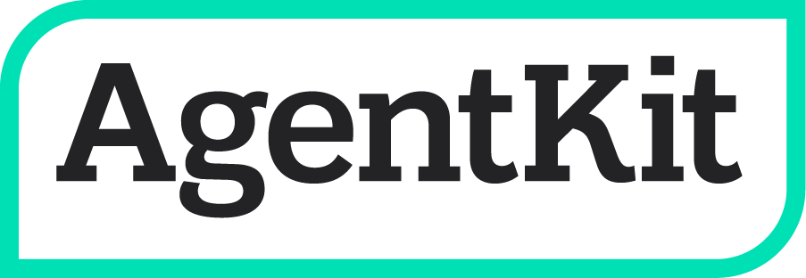
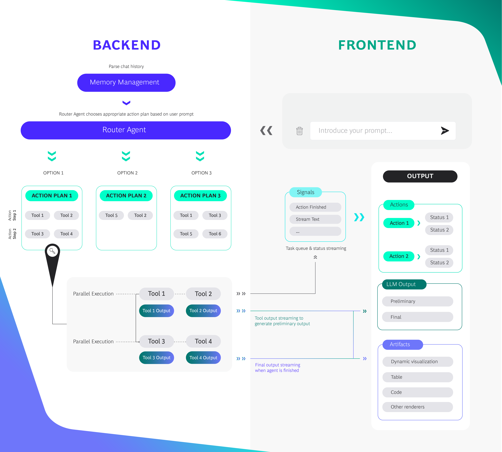
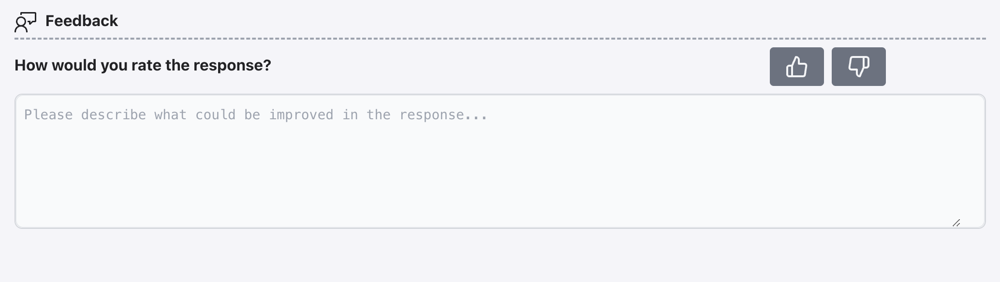
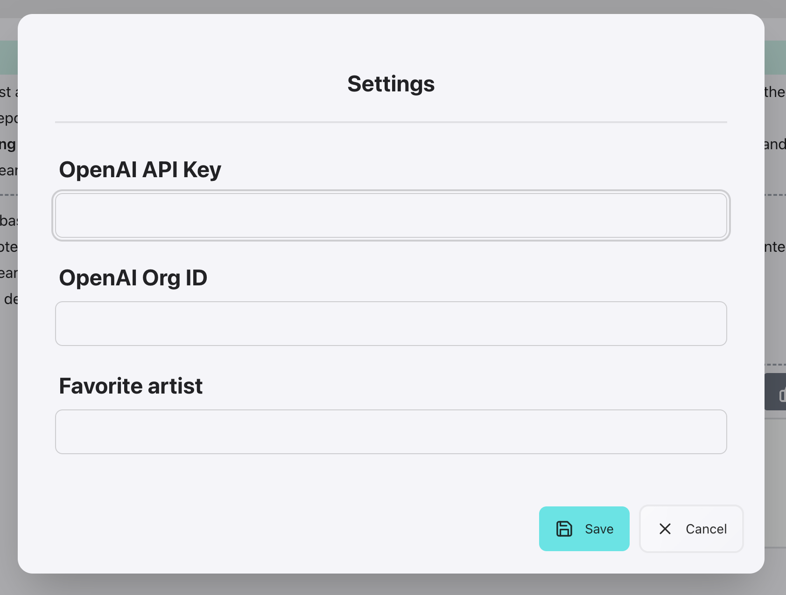
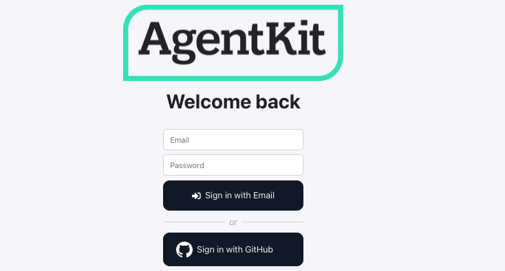

[](https://github.com/BCG-X-Official/agentkit/actions/workflows/lint-backend.yml?query=branch%3Amain)
[](https://github.com/BCG-X-Official/agentkit/actions/workflows/lint-frontend.yml?query=branch%3Amain)
[](https://github.com/BCG-X-Official/agentkit/actions/workflows/tests.yml?query=branch%3Amain)

# AgentKit: rapidly build high quality Agent apps
AgentKit is a LangChain-based starter kit developed by BCG X to build Agent apps. Developers can use AgentKit to
- Quickly experiment on your constrained agent architecture with a beautiful UI
- Build a full stack chat-based Agent app that can scale to production-grade MVP

Key advantages of the AgentKit toolkit include:
- 🚀 **Quickly build high quality Agent apps**: Build a strong demo in a few hours using a modular, easy to configure tech stack based on FastAPI/Nextjs and a library of useful GenAI tools
- 💻 **Flexible, reactive UI/UX designed for Agents**: React/Nextjs chat-based UI that is easy to configure, with features such as streaming, rendering of tables/visualizations/code, status of Agent actions and more
- 🛡️ **Focus on reliability**: Easy to configure routing architecture gives control of possible paths Agent can take, increasing reliability and making it suited for real-life use cases
- 📈 **Set up to scale**: Set up to scale to MVP with ready made Queue Management, Auth, Caching, Monitoring etc.


https://github.com/BCG-X-Official/agentkit/assets/103188952/8e86fd0e-24a5-4335-8dba-06f1cefa8dd9


### Tech stack
The starter pack is based on the latest technologies for optimal performance, security and developer experience.
* 💫 Nextjs 14 with tailwind and daisyui
* 🔥 Python 3.10 with fastapi, sqlmodel and pydantic 2.x.
* 🦜 Langchain and Langsmith e2e configuration
* 🗝 Authentication: NextAuth integrated with FastAPI
* 🥬 Celery and redis for long running tasks, caching etc.
* 💾 Local Postgres with pgvector extension
* ⬆️ Docker-compose for simple deployments and DX
* 🖍 Linting, tests and pre-commit hooks pre-configured

Note: this is a starter kit - for production deployments, we recommend adding enterprise-grade security functionalities. Especially when using LLMs, be aware of known risks like prompt injection ([read more](https://www.ibm.com/topics/prompt-injection)).

## Quickstart
For a quick setup of AgentKit, use the steps below, where both the backend app and frontend app are run inside a Docker container. More elaborate setup instructions can be found in the [documentation](https://agentkit.infra.x.bcg.com/docs/introduction).

### Prerequisites
- Docker: https://www.docker.com/get-started

### Installation steps
1. Clone the repository containing the source code for the backend and frontend apps.

2. Copy the `frontend/.env.example` file in the frontend directory and change the name to `.env`. Also, copy the `.env.example` file in the root directory of the repository and change the name to `.env`.
   - Change the OPENAI_API_KEY and OPENAI_ORGANIZATION to your own (n.b. OPENAI_ORGANIZATION should be your OpenAI 'Organization ID')

3. In the terminal, navigate to the root directory of the cloned repository. Build and start the Docker containers with the following command:
   ```
   docker-compose -f docker-compose.yml up -d
   ```
   Wait for the containers to build and start, which may take a few minutes depending on your system. Once the containers are up and running, you can access the apps in your browser at [http://localhost](http://localhost/).

## Chinook music database demo
- If docker containers are running, run `docker-compose down --volumes`
- Follow the installation instructions above and swap `docker-compose.yml` with `docker-compose-demo.yml` to run the app
- Try the prompt "How many artists and songs are there in the database?" to see AgentKit in action!

Check out a more advanced [demo](https://agentkit.infra.x.bcg.com) build following the [tutorial](https://agentkit.infra.x.bcg.com/docs/tutorial/).

## Set up your own app
- Configure your Agent and Tools [link](docs/docusaurus/docs/configuration/configure_agent_and_tools.md)
- (Optional) Adjust the UI to your use case [link](docs/docusaurus/docs/configuration/configure_ui.md)
- (Optional) Set up evaluation with LangSmith [link](docs/docusaurus/docs/advanced/evaluation.md)

## Documentation
Find the [hosted documentation here](https://agentkit.infra.x.bcg.com/docs/introduction).

- [Installation instructions for running frontend or entire app outside Docker](https://agentkit.infra.x.bcg.com/docs/setup/setup_development)
- [Key concepts](https://agentkit.infra.x.bcg.com/docs/how_it_works/key_concepts)
- [Agent and Tools configuration](https://agentkit.infra.x.bcg.com/docs/configuration/configure_agent_and_tools)
- [UI configuration](https://agentkit.infra.x.bcg.com/docs/configuration/configure_ui)
- [Optional features](https://agentkit.infra.x.bcg.com/docs/advanced/optional_features)
- [Tool library](https://agentkit.infra.x.bcg.com/docs/tool_library/)

## How it works

### Reliability
AgentKit attempts to solve the reliability issue of agents such as ReAct agents by constraining the potential routes the agent can take to a pre-configured sets of routes, or **Action Plans**. Since for many use cases the potential routes the agent can take are known, we can use our human domain expertise to steer the agent in the right direction, and reduce it going into unexpected directions or rabbit holes. This is achieved by combining a **Meta Agent** with **Action Plans**: A set of tools which are executed linearly and in parallel, similar to a Chain. The Meta Agent takes in the user prompt and outputs the most suited Action Plan to generate an answer. Note: implementing multiple Meta Agents is possible, generating a tree of possible routes.

### User experience
To optimize user experience, the intermediary output of every step in the Action Plan can be shown to the user. For example, consider an Action Plan consisting of 2 toolsets: `[[sql_tool, pdf_tool], [generate_summary_tool, visualize_tool]]`. In the first action step, information from a SQL database and a vector database with embedded PDFs are retrieved in parallel. The retrieved data and most relevant PDF are streamed to the UI as soon as the first action step finishes. In the second action step, the output from step 1 is passed to a tool that generates a text summary and a tool that creates a JSX visualization from the data, which is streamed to the UI to create the final answer.

For a high level overview of the routing flow and connection the UI, please see below diagram:


## Additional optional features

- **Feedback integration**: collect feedback on generated answers from users



- **User settings**: Allow users to specify default settings in the app that can be used to customize prompts for the user



- **User authentication**: Enable NextAuth on your app to authenticate users with Github or with email/password



See [optional feature documentation](docs/docusaurus/docs/advanced/optional_features.md) for more detailed info.

## Star History

[](https://star-history.com/#BCG-X-Official/agentkit&Timeline)

## Support and Maintenance

The project spun of a combination of different templates. One great inspiration is [fastapi-alembic-sqlmodel-async](https://github.com/jonra1993/fastapi-alembic-sqlmodel-async), which provided the foundations for the FastAPI setup. Please check them out!

Great thanks to all the contributors:
[@kaikun213](https://github.com/kaikun213) [@drivian](https://github.com/drivian) [@ielmansouri](https://github.com/ielmansouri) [@mastersplinter](https://github.com/mastersplinter) [@tanmaygupta9](https://github.com/tanmaygupta9) [@sofglide](https://github.com/sofglide) [@harticode](https://github.com/harticode) [@edenbd](https://github.com/edenbd) [@ben-howt](https://github.com/ben-howt) [@carelschw](https://github.com/carelschw) [@gustafvh](https://github.com/gustafvh) [@casper321](https://github.com/casper321) [@modvinden1](https://github.com/modvinden1) [@valerie-jzr](https://github.com/valerie-jzr) [@ispoljari](https://github.com/ispoljari) [@martinthenext](https://github.com/martinthenext) [@rkdy](https://github.com/rkdy)

Please read `CONTRIBUTING.md` for more details on how to contribute.
PRs are welcome ❤️

## License

[](http://badges.mit-license.org)

- This project is licensed under the terms of the **[MIT license](LICENSE)**
