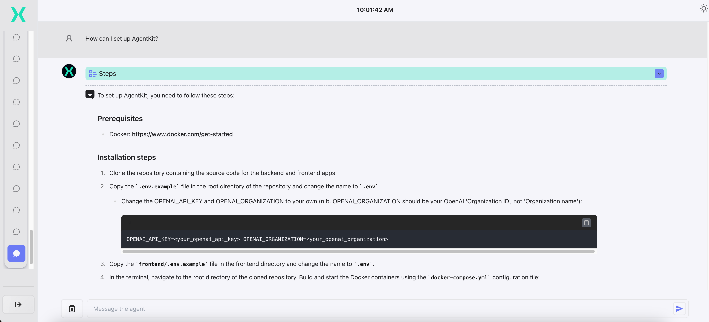
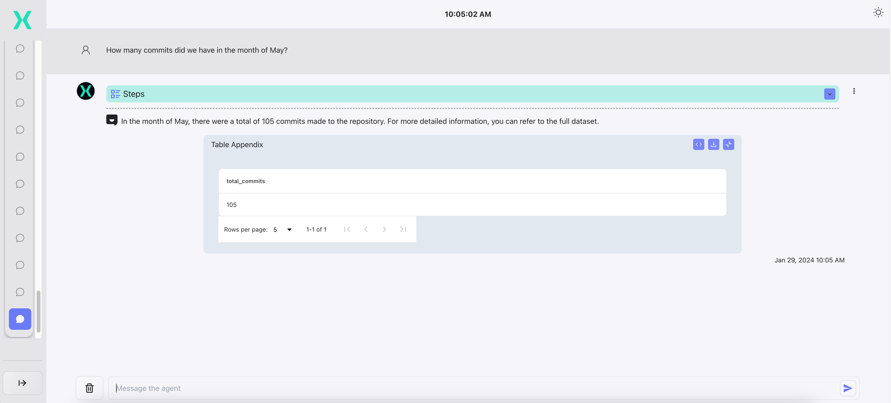

# Tutorial: AgentKit Codebase Helper


Let's run through a full example of how you can rapidly build a high quality Agent application using AgentKit.

We're going to build an Agent which can guide us through a GitHub repository, with access to two sorts of information:

1. **Codebase documentation**: All documentation in the codebase, including setup instructions, overall architecture, and feature-specific docs.
2. **GitHub repository commit history**: Commit log from the GitHub repository. We want this data to be in tabular form.

Developers can use this Agent to familiarize themselves with the contents of the repository, ask questions, and track contributions (e.g. "What were the latest commits from Joe to the frontend?"). The agent will use semantic similarity to retrieve information from
the documentation (RAG) and generate a SQL query to retrieve information from the GitHub repository information. This can be easily extended to also include code files and more complex tools such as optimization or ML based tools (see [public demo](https://agentkit.infra.x.bcg.com/) for an example).


In this example, we'll use data from the AgentKit repository itself (meta!), but you can do this for any repository. We'll assume you have run through the [setup](docs/setup/setup.md).

All it takes is 3 steps:

## Step 1: Ingest data
### Documentation (markdown or PDF)
The first thing we'll do is ingest the documentation that we can use to answer questions. You can use your own codebase or follow along ingesting the AgentKit documentation, which is already loaded in `backend/app/app/tool_constants/tutorial_data`. Make sure you update `PDF_TOOL_DATA_PATH` to this path in `.env`. If the PDF tool is enabled (`PDF_TOOL_ENABLED="true"` in .env), the ingestion pipeline in `vector_db_pdf_ingestion.py` will run to embed the data and store it in a local `PGVector` vector database.

### Commit history

Next, we're going to ingest the CSV of commit data. This is stored in `backend/app/app/tool_constants/tutorial_data/commit_history.csv`. Next, we are going to create a SQL script in `scripts/sql_db_tool/` to load the commit data into the database in our Docker container `database`, calling it `2-load_commits.sql` (to ensure it's run after `1-create-dbs.sql`). By default, the data is loaded into the `postgres` database. The `2-load_commits.sql` looks like:
```sql
-- Create table
CREATE TABLE COMMITS (
    commit_hash TEXT,
    commit_timestamp TIMESTAMP,
    commit_user TEXT,
    commit_message TEXT,
    file_changed TEXT
);

-- Copy CSV
COPY COMMITS (commit_hash, commit_timestamp, commit_user, commit_message, file_changed)
FROM '/docker-entrypoint-initdb.d/commit_history.csv'
WITH CSV HEADER;
```

Notice that the CSV path is referenced as `/docker-entrypoint-initdb.d/commit_history.csv`. This is because we need to map
local paths to paths within the Docker container running the `database` service.

Finally, the last step is to go to `docker-compose.yml` (or whichever `docker-compose` file you're using) and add the `commit_history.csv` file into the container, and run the script generating our SQL database to the database container so the data is loaded when the container starts up.
This is what it looks like:
```yaml
  database:
    image: ankane/pgvector:v0.4.1
    restart: always
    container_name: database
    env_file: ".env"
    user: root
    volumes:
      - ./db_docker:/var/lib/postgresql
      - ./scripts/1-create-dbs.sql:/docker-entrypoint-initdb.d/1-create-dbs.sql
      - ./backend/app/app/tool_constants/tutorial_data/commit_history.csv:/docker-entrypoint-initdb.d/commit_history.csv
      - ./scripts/sql_db_tool/2-load_commits.sql:/docker-entrypoint-initdb.d/2-load_commits.sql
    ports:
      - 5432:5432
    expose:
      - 5432
    environment:
      - POSTGRES_USERNAME=${DATABASE_USER}
      - POSTGRES_PASSWORD=${DATABASE_PASSWORD}
      - POSTGRES_DATABASE=${DATABASE_NAME}
      - POSTGRES_HOST_AUTH_METHOD= "trust"
```
## Step 2: Write action plans

The second step is to write action plans to use our tools. Recall that we want two functionalities: 
1. Retrieve relevant docs from codebase documentation and use them to answer the user's question
2. Generate and execute a SQL query to retrieve data from the commit history

AgentKit provides off-the-shelf library tools for both of these things.

We can use two simple action plans in `agent.yml`:
```yaml
action_plans:
  '0':
    name: ''
    description: Use this plan to answer technical questions about AgentKit - related to setup, code, codebase navigation, or other technical questions.
    actions:
      - - pdf_tool

  '1':
    name: ''
    description: |-
      Use this plan to fetch Github-related information from the repository of AgentKit, such as commits, issues, pull requests.
    actions:
      - - sql_tool
      - - expert_tool
```

In action plan '0', we use the `pdf_tool` to retrieve relevant documentation and answer the user's question.
In action plan '1', we first retrieve relevant data with the `sql_tool`, and then pass that data to `expert_tool` to answer the user's question.

## Step 3: Configure tools and prompts

Finally, we will configure the tools and prompts for the defined action plans. For question and answering with RAG, we can use `pdf_tool` to retrieve documents and answer questions. No changes need to be made to `pdf_tool`, but we will change the prompts in `tools.yml` slightly:

```
pdf_tool:
    description: >-
      Summarization and Q&A tool to answer questions about the codebase.
      The tool identifies the relevant documentation and answers the users question.
      Input is a query string, output is a string the answer to the user question.
      {examples}
    prompt_message: |-
      Documentation extracts:
      {{retrieved_docs}}

      User Question:
      {{question}}
    system_context: |-
      You are an expert in answering questions on a codebase based on the AgentKit codebase.
      You need to answer a user's question based on retrieved relevant documentation.
    prompt_inputs:
      - name: examples
        content: |-
          Example Input: \"User question: How do I create a new tool?\"
          Example Output: \"Start by creating a new folder in `services/chat_agent/tools`..\"
```

We also don't need to change any code in `sql_tool` for data retrieval from the commit history. We do, however, need to add prompts to tell the tool the structure of our data in `tools.yml`:

```yaml
sql_tool:
    description: >-
      SQL tool to query structured table containing commit history of the Github repository of AgentKit, an LLM powered agent.
      Input is a question about the data in natural language, output is a string that contains an SQL query in markdown format, the number of rows the query returns and the first 3 rows.
      {examples}
    prompt_message: |-
      Given the database schema:
      ---
      {{table_schemas}}
      ---
      And the following notes about the tables:
      ---
      {table_notes}
      ---
      Please answer the following user questions with an SQL query:
      {{question}}
    system_context: |-
      You are an expert on the GitHub repository of AgentKit, an LLM-powered agent. Your main task is to use
      SQL queries to retrieve information from structured tables containing commit history of the repository.
      During answering, the following principles MUST be followed:
      1. Set the language to the markdown code block for each code block. For example, \```sql SELECT * FROM public.Artist``` is SQL.
      2. Use the postgreSQL dialect, i.e. only functions that are supported
      3. DO NOT make any DML statements (INSERT, UPDATE, DELETE, DROP etc.) to the database.
      4. In WHERE clauses use substring comparison to account for unknown string formulations (e.g. commit -> LIKE '%commit%')
      6. Make sure the final SQL query starts with '```sql' and ends with '```'
      7. Only use field and table names from the provided database schemas
      8. Ensure to include the schema name before the table, for example, \```sql SELECT * FROM public.COMMITS``` is correct but \```sql SELECT * FROM COMMITS``` is INCORRECT
      9. When asked to give time aggregated data (e.g. monthly), provide the time unit as an integer. For example, months should be 1-12, where you can the EXTRACT statement
      10. Always keep in mind that each `commit_hash` can correspond to multiple rows public.COMMITS; when counting commits, only count DISTINCT values of `commit_hash`
      11. When asked to summarize a user's contributions to the codebase, look at their 20 most recent commits.
    prompt_inputs:
      - name: examples
        content: |-
          Example Input: \"List all users who have made commits to the AgentKit repository"
          Example Output: \"`sql SELECT DISTINCT commit_user FROM public.COMMITS;`, total rows from SQL query: 8, first 3 rows: Ilyass El Mansouri, Gustaf Halvardsson, Casper Lindberg\"
      - name: table_definitions
        content: |-
          public.db_table | description
          public.COMMITS | Table with all commits made to the AgentKit repository; columns include commit user, commit message, commit timestamp, and file change. Each (commit, file changed) is a single row
      - name: table_notes
        content: |-
          Table name:
          public.COMMITS
          Table description:
          Table with all commits made to the AgentKit repository.
          Columns include commit user, commit message, commit timestamp, and file change.

    prompt_selection: |-
      Given the following tables:
      ---
      {table_definitions}
      ---
      Please reply only with a comma separated list of the db and the table names.
      Select the tables that can be most useful for answering to the question:
      {{question}}
    system_context_selection: |-
      You are a software engineering expert on the AgentKit codebase, an LLM-powered assistant. You have access to a
      PostgreSQL database which has tables consisting of the commit history of the AgentKit GitHub repository.

      Your task is to define which tables are useful to answer the question of the user.
      Please follow the instructions to answer the questions:
      1. Only reply with a comma separated list of db and table names. For example, "public.COMMITS"
      2. Only answer with valid table names from the list
      3. Always format the table names to include the database schema, for example "public.COMMITS", NOT "COMMITS"
      3. Reply with the least amount of tables necessary for the question
    prompt_validation: |-
      Given the following SQL query:
      {{query}}
      and the following results executing the query with a LIMIT 5:
      {{result}}
      Does the query answer the following question:
      {{question}}
      You must reply in the following format:
      Valid: [yes/no]
      Reason: [your reason for the validation]
    system_context_validation: |-
      You are a software engineering expert on the AgentKit codebase, an LLM-powered assistant. You have access to a
      PostgreSQL database which has tables consisting of data from the AgentKit GitHub repository, including commits,
      issues, and pull requests.
      You should validate that the constructed SQL query is answering the question of the user.
      You must reply in the following format:
      Valid: [yes/no]
      Reason: [your reason for the validation]
    prompt_refinement: |-
      Given the database schema:
      ---
      {{table_schemas}}
      ---
      Given your previous answer and the complaint from the user, please improve the SQL query to answer the question of the user.
      If the SQL query does not contain the database schema before a table, correct it. For example "SELECT * FROM COMMITS" should be corrected to "SELECT * FROM public.COMMITS".
      User question: {{question}}
      Previous answer: {{previous_answer}}
      Complaints: {{complaints}}
    nb_example_rows: 3
    validate_empty_results: False
    validate_with_llm: False
    always_limit_query: False
    max_rows_in_output: 30
```
The configs give the tool information about the commits table, allowing it to write an informed query.

Lastly, we're going to add a tool that reads the data obtained from `sql_tool` and answers the user's question in text. To do this, we're going to slightly adjust the `basellm_tool` template (which can be used for simple LLM calls with input from previous tools) and create a new tool called `expert_tool`. We have to add a few lines of code to the `_arun` method of `basellm_tool` to take the data retrieved by `sql_tool` in previous steps and add them to the prompt:
```python
class BaseLLM(ExtendedBaseTool):

    # Other code omitted ...

     async def _arun(
        self,
        *args: Any,
        run_manager: Optional[AsyncCallbackManagerForToolRun] = None,
        **kwargs: Any,
    ) -> str:
        """Use the tool asynchronously."""
        try:
            query = kwargs.get(
                "query",
                args[0],
            )
            tool_input = ToolInputSchema.parse_raw(query)
            user_question = tool_input.latest_human_message

            data = tool_input.intermediate_steps["sql_tool"]

            messages = [
                SystemMessage(content=self.system_context),
                HumanMessage(content=self.prompt_message.format(question=user_question, retrieved_data=data))
            ]
            response = await self._agenerate_response(messages, discard_fast_llm=True, run_manager=run_manager)

            logger.info(f"Expert Tool response - {response}")

            return response
        except Exception as e:
            if run_manager is not None:
                await run_manager.on_tool_error(e, tool=self.name)
                return repr(e)
            raise e
```
The code above parses the input provided to the tool, taking out the user prompt in `user_question` and the retrieved data from `sql_tool` in `intermediate_steps`. It then formats these into the prompt for the `expert_tool` (defined as class of BaseLLM in `tools.py`), which needs to be set in `tools.yml`:

```yaml
expert_tool:
    default_llm: "gpt-4"
    default_fast_llm: "gpt-3.5-turbo-1106"
    description: >-
      Tool to answer the user question based on the data retrieved by the sql_tool.
      {examples}
    prompt_message: |-
      Answer the user's question based on the data retrieved.
      User question:
      <<<
      {{question}}
      >>>
      Retrieved data:
      <<<
      {{retrieved_data}}
      >>>
      Concise Answer:
    system_context: |-
      You are an expert in software engineering and communicating technical ideas. Your goal is to answer the user question solely based on the given data.
    prompt_inputs:
      - name: examples
        content: |-
          Example Input: "How many commits are there in total?"
          Example Output: "There were a total of 50 commits made."
    max_token_length: 8000
```

To recap, here's what's happening: `sql_tool` retrieves data from our SQL database, passes that to the next action step where the `expert_tool` is tasked
with synthesizing an answer using the data. You can imagine how this can be used to create complex prompt chains, where for example in the first step, information is obtained from 5 different sources in parallel, which is then summarized and passed to an `expert_tool` type tool which can interpret the various data sources and formulate an answer. See [the `agent.yml` file for the public demo](https://github.com/BCG-X-Official/agentkit/blob/github-com/demo/backend/app/app/config/agent.yml) for a slightly more advanced example.

## Conclusion

In three simple steps, we have set up a high quality Agent app which can provide informed guidance on a codebase. See the results below!

Fetching docs:


Querying commits:

